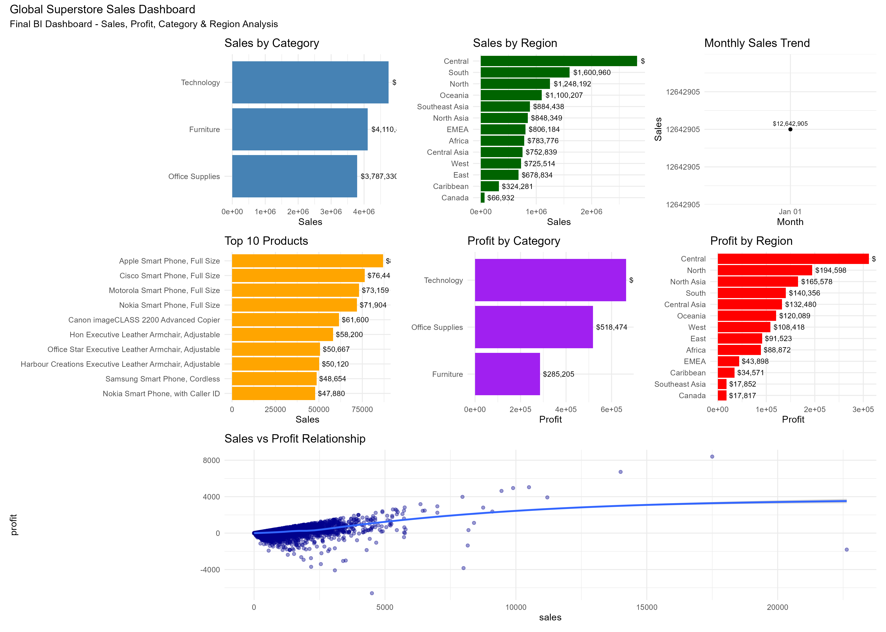

# Global_E-commerce_BI_project

# 📊 Global Superstore Business Intelligence Project

## 👨‍💻 Author
**Mohamed Abdirashid**

Data Analyst | Business Intelligence Enthusiast | Data Science Learner

---

## 📌 Project Overview

This project is a complete **Business Intelligence analysis** of the Global Superstore dataset using **R Programming**.

The goal is to transform raw sales data into **meaningful business insights** through:

- Data Cleaning
- Exploratory Data Analysis (EDA)
- Data Visualization
- Dashboard Creation

---

## 🎯 Objectives

- Understand sales performance across categories and regions
- Identify profit trends and key business drivers
- Analyze monthly sales performance
- Highlight top-performing products
- Build a professional BI dashboard using R

---

## 🧰 Tools & Libraries Used

- R Programming
- tidyverse
- ggplot2
- lubridate
- janitor
- scales
- patchwork
- gridExtra

---

## 📁 Project Structure
scripts/
├── 01_data_import.R
├── 02_data_cleaning.R
├── 03_eda.R
├── 04_dashboard.R

data/
├── raw/
├── processed/

outputs/
├── charts/
├── dashboard/


## 📊 Dashboard Preview



---

## 📊 Key Analysis Performed

### 🔹 KPI Metrics
- Total Sales
- Total Profit
- Profit Margin
- Total Orders

### 🔹 Business Insights
- Sales by Category
- Sales by Region
- Monthly Sales Trends
- Top 10 Products
- Profitability Analysis

---

## 📈 Dashboard Preview

> A final interactive-style dashboard was created combining multiple charts into a single layout using `patchwork`.

📌 Output includes:
- 7 integrated charts
- Clean BI layout
- Executive-level insights

---

## 💡 Key Insights

- Technology category is one of the highest revenue generators
- Certain regions outperform others in both sales and profit
- Some high-sales products do not always generate high profit
- Sales show clear monthly fluctuations indicating seasonality

---

## 🚀 Future Improvements

- Add interactive dashboard using Shiny
- Automate reporting system
- Integrate real-time data sources
- Advanced predictive modeling (forecasting sales)

---

## 📷 Sample Output

*(Add screenshots of your dashboard from outputs/dashboard folder)*

---

## 📬 Contact

📧 Email: Guhaad970@gmail.com 
💼 LinkedIn: https://linkedin.com/in/Mohamed_Abdirashid 

---

## ⭐ If you like this project

Give it a ⭐ on GitHub and feel free to explore the code!
```

---

